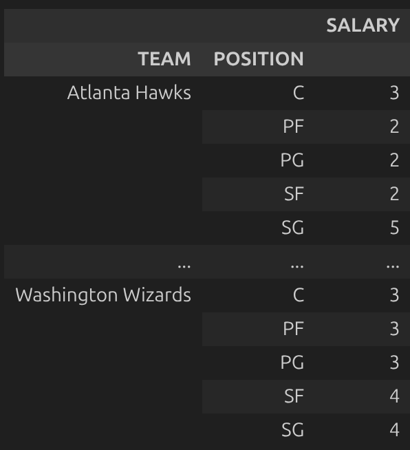
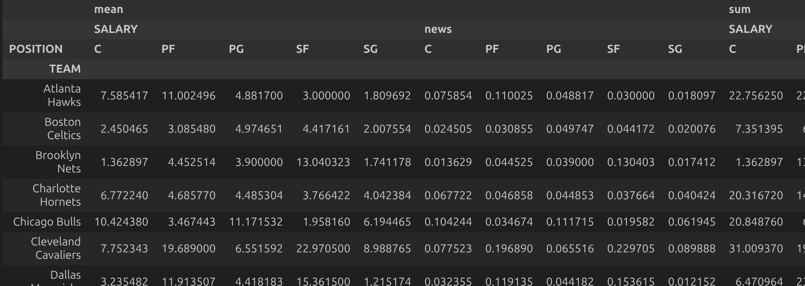

## main idea
python中pandas包(表格数据处理)的基本用法
- 筛选
- 分组
- 增减列及重命名
- merge(合并)
## 一. 筛选
1. 在pandas表格中, 用.get函数可以获取表格的一列, 得到一个index和该列一一对应的series.
```python
salaries.get('2015_SALARY')
# 其实可以直接用下面的格式,但是老师似乎习惯用.get()
salaries['POSITION']
```
```
Paul Millsap       18.671659
Al Horford         12.000000
Tiago Splitter      9.756250
Jeff Teague         8.000000
Kyle Korver         5.746479
                     ...    
Gary Neal           2.139000
DeJuan Blair        2.000000
Kelly Oubre Jr.     1.920240
Garrett Temple      1.100602
Jarell Eddie        0.561716
```
2. 通过在series上作用一个判断语句(>,<,==)等, 可以根据条件判断的真假在对应位置得到true和false; 而这可以通过(|,&)运算进一步处理.得到bool series
**注意, 判断语句必须单独用括号包裹.Must use parentheses around each query.**
```python
(salaries.get('POSITION') == "PG")
```
```
PLAYER
Paul Millsap       False
Al Horford         False
Tiago Splitter     False
Jeff Teague         True
Kyle Korver        False
                   ...  
Gary Neal           True
DeJuan Blair       False
Kelly Oubre Jr.    False
Garrett Temple     False
Jarell Eddie       False
```
```python
(salaries.get('POSITION') == "PG") | (salaries.get('POSITION') == "SG")
```
```
PLAYER
Paul Millsap       False
Al Horford         False
Tiago Splitter     False
Jeff Teague         True
Kyle Korver         True
                   ...  
Gary Neal           True
DeJuan Blair       False
Kelly Oubre Jr.    False
Garrett Temple      True
Jarell Eddie        True
```
3. 而这些true和false可以作为筛选器, 回到表格中筛选.注意这里用方括号.可以筛出来值为true的表格中的行
 
| 符号 | 名称            | 主要用途                           |
| ---- | --------------- | ------------------------------- | 
| `()` | 圆括号 / 小括号 | 调用函数、元组、运算优先级  |
| `[]` | 方括号 / 中括号 | 索引/切片（访问序列元素）、列表 |

```python
salaries[(salaries.get('TEAM') == 'Sacramento Kings') & (salaries.get('2015_SALARY') > 8)]
```
```
	                POSITION	TEAM	        2015_SALARY
PLAYER			
DeMarcus Cousins	C	Sacramento Kings	15.851950
Rudy Gay	        SF	Sacramento Kings	12.403101
Rajon Rondo	        PG	Sacramento Kings	9.500000
```
至于作为index的变量不需要用到筛选, 会返回完整的一行
```python
salaries.loc['Rajon Rondo']
#作为条件,也可以
(salaries.index != 'Dwight Howard')
```

## 二. 分组
pandas的分组运作原理为:
- 按照分组标准分为多个不同的dataframe
- 每个dataframe内部按照函数要求运算
- 生成以分组为索引, 函数运算结果为内容的新dataframe (所以有时需要reset_index)

### 函数类型
1. 一般的groupby使用的函数叫**Aggregation Function（聚合函数）**
聚合函数是对一组数据进行汇总计算，返回单个值的函数。
例如 ```df['attack'].mean()      # 计算攻击力的平均值```

agg函数包括:```.count(), .sum(), .mean(), .median(), .max(), .min()```等

```python
salaries.groupby('TEAM').sum() #我的Jupiter Notebook会把字符串加起来,但标准的应该不会
salaries.groupby('TEAM').mean(numeric_only=True)
```
它把groupby的标准设置为新的index,从而给每一组返回单个的结果值

2. 也可以使用**transform函数**来进行分组运算
```python
salaries['Team_Payroll'] = (
    salaries.groupby('TEAM')['2015_SALARY']
       .transform('sum')
)
```
保持原表格的主要内容,多加一列为运算结果
```
	POSITION	TEAM	2015_SALARY	Team_Payroll
PLAYER				
Paul Millsap	PF	Atlanta Hawks	18.671659	69.573103
Al Horford	C	Atlanta Hawks	12.000000	69.573103
Tiago Splitter	C	Atlanta Hawks	9.756250	69.573103
Jeff Teague	PG	Atlanta Hawks	8.000000	69.573103
Kyle Korver	SG	Atlanta Hawks	5.746479	69.573103
```
### 多分组
```python
nba.groupby(['TEAM','POSITION']).count()
```


```python
nba.groupby(['TEAM', 'POSITION']).count().loc[('Atlanta Hawks',  'C')]
```
之后如果需要排序其中的一些数据, 先用`reset_index()`展平所有,再`sort_values`

### pivot table 透视表
```python
position_pivot = nba.pivot_table(index='TEAM',     # rows (turned into index)
    columns='POSITION',    # column values
    values=['SALARY','news'],
    aggfunc=[np.mean, np.sum],   # group operation
)
```
得到一组以team为纵坐标, 'position'为横坐标的多重表格,本质是多分组的一种变形


## 三. 增减列及重命名
.assign可以分配新的列
```python
c=salaries.assign(NEW_SALARY = salaries.get('2015_SALARY'))
c=c.drop(columns='2015_SALARY',inplace=False) 
c
```
inplace=False指不改变原dataframe
这时agg不合适,需要用transform
```python
# 原数据保持不变
salaries_with_payroll = salaries.assign(
    Team_Payroll=salaries.groupby('TEAM')['2015_SALARY'].transform('sum')
)
# salaries_with_payroll 是新 DataFrame
```
## 四. merge(合并)
当两个表有共同的key列时,可以合并.
比如

**phones**
<div>

<table border="1" class="dataframe">
  <thead>
    <tr style="text-align: right;">
      <th></th>
      <th>Model</th>
      <th>Price</th>
      <th>Screen</th>
    </tr>
  </thead>
  <tbody>
    <tr>
      <th>0</th>
      <td>iPhone 13</td>
      <td>799</td>
      <td>6.1</td>
    </tr>
    <tr>
      <th>1</th>
      <td>iPhone 13 Pro Max</td>
      <td>1099</td>
      <td>6.7</td>
    </tr>
    <tr>
      <th>2</th>
      <td>Samsung Galaxy Z Flip</td>
      <td>999</td>
      <td>6.7</td>
    </tr>
    <tr>
      <th>3</th>
      <td>Pixel 5a</td>
      <td>449</td>
      <td>6.3</td>
    </tr>
  </tbody>
</table>
</div>

**inventory**
<div>

<table border="1" class="dataframe">
  <thead>
    <tr style="text-align: right;">
      <th></th>
      <th>Handset</th>
      <th>Units</th>
      <th>Store</th>
    </tr>
  </thead>
  <tbody>
    <tr>
      <th>0</th>
      <td>iPhone 13 Pro Max</td>
      <td>50</td>
      <td>Westfield UTC</td>
    </tr>
    <tr>
      <th>1</th>
      <td>iPhone 13</td>
      <td>40</td>
      <td>Westfield UTC</td>
    </tr>
    <tr>
      <th>2</th>
      <td>Pixel 5a</td>
      <td>10</td>
      <td>Fashion Valley</td>
    </tr>
    <tr>
      <th>3</th>
      <td>iPhone 13</td>
      <td>100</td>
      <td>Downtown</td>
    </tr>
  </tbody>
</table>
</div>

共有四种合并方式:
```python
# inner（默认）- 只保留匹配的
phones.merge(inventory, left_on='Model', right_on='Handset')

# left - 保留所有手机型号（包括没库存的）
phones.merge(inventory, left_on='Model', right_on='Handset', how='left')

# right - 保留所有库存记录（包括不在手机列表中的）
phones.merge(inventory, left_on='Model', right_on='Handset', how='right')

# outer - 保留所有
phones.merge(inventory, left_on='Model', right_on='Handset', how='outer')
```
当key列名统一时,可以简化
```python
phones.merge(inventory_relabeled, on='Model')
```
按index匹配
```python
phones.merge(inventory_by_handset, left_on='Model', right_index=True)
```
## 五. 常用函数补充

| 方法/属性 | 用途 | 示例 |
|-----------|------|------|
| `.shape` | 获取行数列数（属性，无括号） | `states.shape` → `(50, 8)` <br> `states.shape[0]` → `50`（行数） <br> `states.shape[1]` → `8`（列数） |
| `.index` | 获取行索引,比如用于取第一个 | `salaries.index[0]` → `'Paul Millsap'` <br> `salaries.index[-1]` → `'Jarell Eddie'` <br> `salaries.index.tolist()` → 所有球员名单 |
| `.set_index()` | 设置某列为新索引 | `states.set_index('State')` → 将 `'State'` 列变为行索引 <br> `imdb.set_index('Title')` → 将电影名作为索引 |
| `.reset_index()` | 索引重置为数字索引 | `imdb.reset_index()` → 索引变为 `0,1,2,...`，原索引变成 `'Title'` 列 <br> `imdb.reset_index().groupby("Decade").max()` → 重置后方便分组 |
| `.size()` | 分组后统计每组的行数（含NaN） | `imdb.groupby("Decade").size()` → 每十年有多少部电影 <br> `salaries.groupby('TEAM').size()` → 每支球队有多少名球员 |
| `.count()` | 分组后统计每组的非NaN值个数 | `imdb.groupby("Decade").count()` → 每十年有多少部电影（逐列统计） <br> `salaries.groupby('TEAM').count()` → 每支球队有多少名球员（逐列统计） <br> `.size()` 和 `.count()` 区别： <br> - `.size()` 返回一个值/组 <br> - `.count()` 每列分别统计，有缺失值时结果可能不同 |
| `.str.len()` | 计算字符串长度 | `imdb.index.str.len()` → 计算每部电影名字符数 <br> `imdb.assign(title_length=imdb.index.str.len())` → 添加新列存储电影名长度 <br> `states.get('State').str.len()` → 计算州名字符数 |
| `.take([i])` | 按整数位置选取行 | `df.take([0, 1, 2])` → 选取前三行 <br> `df.sort_values(by='Population', ascending=False).take([0, 1, 2])` → 人口最多的前三名 <br> `df.take([-1])` → 选取最后一行 |
| `.loc[]` | 按标签访问 | `states.loc['Pennsylvania', 'Density']` → 宾夕法尼亚州的人口密度 <br> `states.loc[['PA', 'CA'], ['Density', 'Population']]` → 多个行和列 <br> `salaries.loc['Rajon Rondo']` → 获取该球员的所有信息 <br> `salaries.loc['Rajon Rondo', '2015_SALARY']` → 该球员的薪资 |
| `.iloc[]` | 按整数位置访问 | `states.iloc[0, 2]` → 第一行第三列 <br> `states.iloc[0:5, :]` → 前五行所有列 <br> `salaries.iloc[-1]` → 最后一行 <br> `salaries.iloc[:, 1]` → 第二列所有行 |
